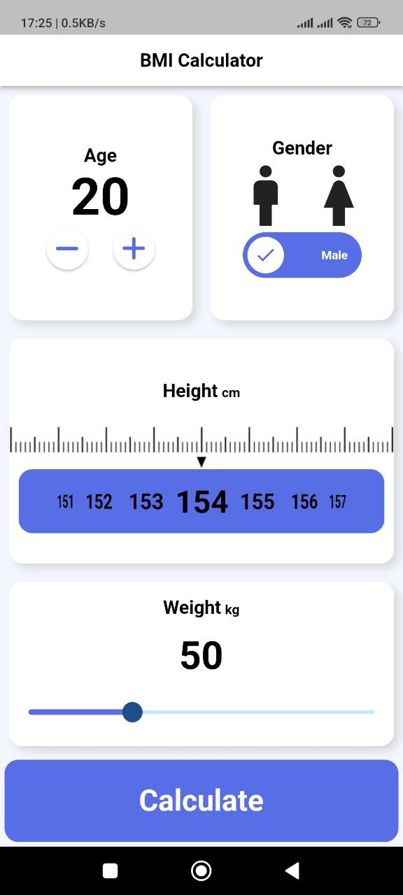
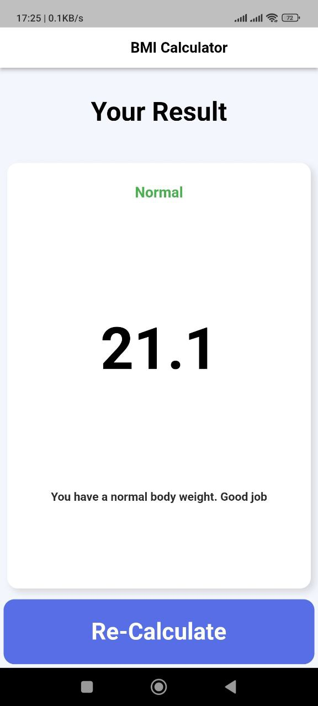

# bmi_calculator

A new Flutter project.

## Getting Started

This app calculates the Body Mass Index of a person.

Some screenshots of the app :

<!-- 
 -->

For help getting started with Flutter development, view the
[online documentation](https://docs.flutter.dev/), which offers tutorials,
samples, guidance on mobile development, and a full API reference.
